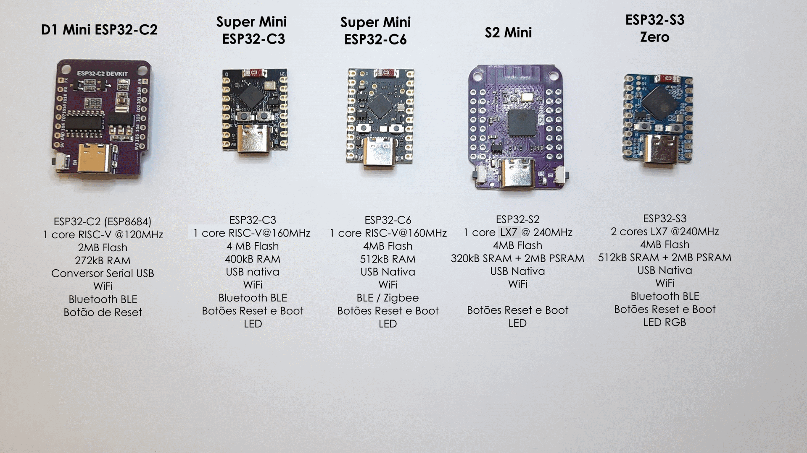

# ESP32 Mini Boards Board

## English

This is a bunch of small boards with various ESP32 models manufactured in China and bought in Brazil (but also available in AliExpress).

### The Boards & Links

#### "Wemos" D1 Mini ESP32-C2

While the ad mentions "Wemos", there is no mention of this board on their site. This is an ESP32-C2 (also known as ESP8684) board that follows the dimensions of the Wemos ESP8266 D1 mini.

Note that software compiled for the ESP8266 **will not** run on the ESP8684.

There is no boot switch (but boot can be commanded through the USB) and no user-control LED.

https://pt.aliexpress.com/item/1005006144059426.html

#### Super Mini ESP32-C3

This is the smallest board in this lot and showcases the ESP32-C3 as a compact and cheap option for simple WiFi or BLE projects.

https://pt.aliexpress.com/i/1005005952121292.html

#### Super Mini ESP32-C6

The ESP32-C6 brings 802.15.4 compatibility, with support for Zigbee and Thread protocols. 

https://pt.aliexpress.com/i/1005006859854983.html

https://wiki.icbbuy.com/doku.php?spm=a2g0o.detail.1000023.1.76faRT4JRT4Jyi&id=developmentboard:esp32-c6mini

#### S2 Mini

The ESP32-S2 lacks Bluetooth support but has an OTG USB. This board has two pin columns at each side, which makes the board more compact but not protoboard-friendly.

The board I got is a Wemos clone.

https://pt.aliexpress.com/item/1005006713792830.html

https://pt.aliexpress.com/item/1005005145720259.html

https://www.wemos.cc/en/latest/s2/s2_mini.html

#### ESP32-S3 Zero

The ESP32-S3 is probably the most powerful ESP32 with WiFi currently available. This board is very compact, at the cost of making only a few pins available in the connectors.

https://pt.aliexpress.com/item/1005006917590200.html

### Comparison Table

| D1 Mini C2  | Super Mini C3 | Super Mini C6 |    S2 Mini     |    S3 Zero     |
| :---------: | :-----------: | :-----------: | :------------: | :------------: |
|  ESP32-C2   |   ESP32-C3    |   ESP32-C6    |    ESP32-S2    |    ESP32-S3    |
| 1  x RISC-V |  1 x RISC-V   |  1 x RISC-V   |   2 1 x LX7    |    2 x LX7     |
|   120 MHz   |    160 MHz    |    160 MHz    |    240 MHz     |    240 MHz     |
|  2MB Flash  |   4MB Flash   |   4MB Flash   |   4MB Flash    |   4MB Flash    |
|  272kB RAM  |   400kB RAM   |   512kB RAM   |   320kB SRAM   |   512kB RAM    |
|             |               |               |   2MB PSRAM    |   2MB PSRAM    |
|    CH340    |  Native USB   |  Native USB   | Native OTG USB | Native OTG USB |
|    WiFi     |     WiFi      |     WiFi      |      WiFi      |      WiFi      |
|     BLE     |      BLE      |      BLE      |                |      BLE       |
|             |               |    Zigbee     |                |                |
|    Reset    |  Reset/Boot   |  Reset/Boot   |   Reset/Boot   |   Reset/Boot   |
|             |   LED (GP8)   |  LED (GP15)   |   LED (GP15)   |   RGB (GP21)   |

### Files

Pinouts and schematics for each board (mostly from the ads).

### My Comments

These cheap and compact boards are great for small non-critical projects or learning about all the ESP32 models.

The ESP32-S3-Zero is, in my opinion, the best price/performance/compactness board in this lot. The Super Mini C3 is a cheaper (and slightly smaller) option if it meets your performance requirements.

## Português

Este é um conjunto de placas compactas fabricadas na China e compradas no Brasil (mas também disponíveis na AliExpress) com diversos modelos do ESP32. 

### As Placas & Links

#### "Wemos" D1 Mini ESP32-C2

Embora os anúncios mencionem "Wemos", não existe nenhuma referência a esta placa no site deles. Esta é uma placa com um ESP32-C2 (também chamado de ESP8684) que segue as dimensões do Wemos ESP8266 mini.

Importante: software compilado para o ESP8266 **não roda** no ESP8684.

A placa não tem botão de boot (mas o boot pode ser comandado pela USB) nem um LED controlável por programa.

Atualmente o suporte ao ESP32-C2 no Arduino requer preparativos mais complicados.

https://pt.aliexpress.com/item/1005006144059426.html

#### Super Mini ESP32-C3

Esta é a menor placa do conjunto e mostra como o ESP32-C3 é uma opção compacta e barata para projetos simples com WiFi ou BLE.

https://pt.aliexpress.com/i/1005005952121292.html

#### Super Mini ESP32-C6

O ESP32-C6 acrescenta compatibilidade com o padrão IEEE 802.15.4, com suporte aos protocolos Zigbee e Thread.

https://pt.aliexpress.com/i/1005006859854983.html

https://wiki.icbbuy.com/doku.php?spm=a2g0o.detail.1000023.1.76faRT4JRT4Jyi&id=developmentboard:esp32-c6mini

#### S2 Mini

A ESP32-S2 não tem suporte a Bluetooth, mas tem USB OTG. Esta placa tem duas fileiras de pinos de cada lado, o que torna a placa mais compacta mas restringe o uso em protoboard.

A placa que eu comprei é um clone da original da Wemos.

https://pt.aliexpress.com/item/1005006713792830.html

https://pt.aliexpress.com/item/1005005145720259.html

https://www.wemos.cc/en/latest/s2/s2_mini.html

#### ESP32-S3 Zero

O ESP32-S3 é, provavelmente, o mais poderoso ESP32 com WiFi atualmente disponível. A placa é bem compacta, ao custo de deixar apenas alguns pinos disponíveis nos conectores.

https://pt.aliexpress.com/item/1005006917590200.html

### Tabela de Comparação

| D1 Mini C2  | Super Mini C3 | Super Mini C6 |    S2 Mini     |    S3 Zero     |
| :---------: | :-----------: | :-----------: | :------------: | :------------: |
|  ESP32-C2   |   ESP32-C3    |   ESP32-C6    |    ESP32-S2    |    ESP32-S3    |
| 1  x RISC-V |  1 x RISC-V   |  1 x RISC-V   |   2 1 x LX7    |    2 x LX7     |
|   120 MHz   |    160 MHz    |    160 MHz    |    240 MHz     |    240 MHz     |
|  2MB Flash  |   4MB Flash   |   4MB Flash   |   4MB Flash    |   4MB Flash    |
|  272kB RAM  |   400kB RAM   |   512kB RAM   |   320kB SRAM   |   512kB RAM    |
|             |               |               |   2MB PSRAM    |   2MB PSRAM    |
|    CH340    |  USB Nativa   |  USB Nativa   | USB Nativa OTG | USB Nativa OTG |
|    WiFi     |     WiFi      |     WiFi      |      WiFi      |      WiFi      |
|     BLE     |      BLE      |      BLE      |                |      BLE       |
|             |               |    Zigbee     |                |                |
|    Reset    |  Reset/Boot   |  Reset/Boot   |   Reset/Boot   |   Reset/Boot   |
|             |   LED (GP8)   |  LED (GP15)   |   LED (GP15)   |   RGB (GP21)   |

### Arquivos

Pinagens e esquemas para cada placa (retirado principalmente dos anúncios)

### Meus Comentários

Estas placas compactas e baratas são órimas para projetos pequenos e não-críticos ou para aprender sobre os vários modelos de ESP32.

O ESP32-S3-Zero é, na minha opinião, a melhor relação preço/desempenho/tamanho no conjunto. A Super Mini C3 é uma opção mais barata (e ligeiramente menor) se ela atender aos seus requisitios de desempenho.
